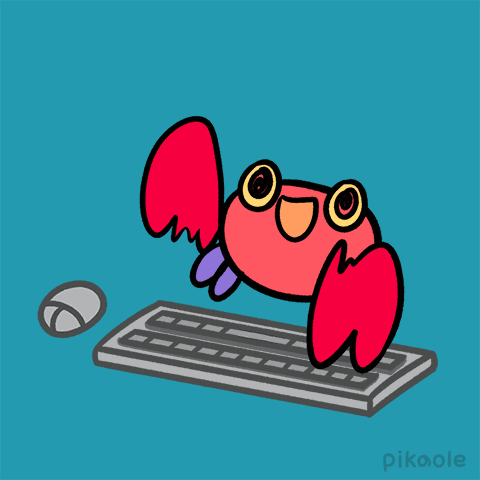

<h1> Welcome to my GitHub Page!</h1>
<figure>

</figure> 
<figcaption>Working Marine Life by Pikaole at <a href="http://pikaole.com/">http://pikaole.com/</a> <figcaption>

***

## About Me
Hello! My name is Mitch and I have worked as an instructional designer for over 5 years. Throughout my career, I've been passionately engaged in researching and exploring various technologies. What I love most about my job is the opportunity to share my knowledge and empower others through effective documentation.

Here's some of the projects I am working on:
* 🌎 **A project I just finished:** I just wrote documentation on how to navigate the Google Earth Web and Google Earth Pro interfaces.
* 🌌 **A project that I am currently working on:** I am creating documentation on how to use Google Sky to map out star systems.
* 🖥️ **A project I plan on starting soon:** I will be building my first homelab! I was just given a Symantec NetBackup 5000 server and need to buy more equipment to get everything connected to my home network. I'll be documenting the process so that you all can follow along!
---
## Tools & Languages
### 📷 Image Editing

* GIMP
* Adobe Illustrator
* Adobe Photoshop

### 📃 Markup Languages
* Markdown
* HTML
* CSS
* AsciiDoc

### 🎥 Video and Audio Editing
* DaVinci Resolve
* Audacity
* Adobe Audition
* Reaper

---
